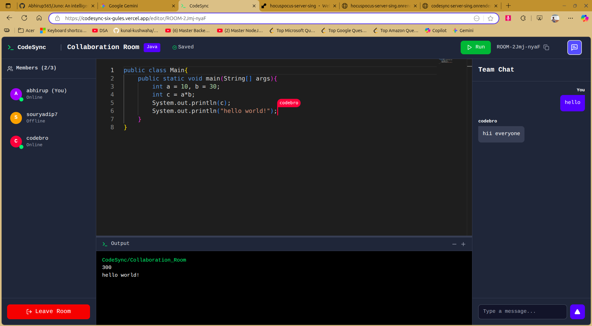
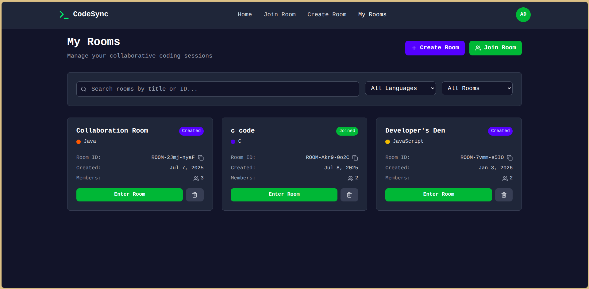
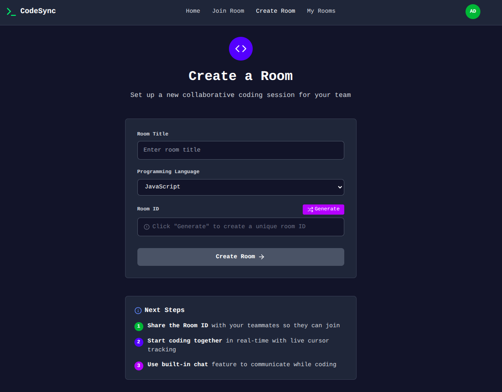
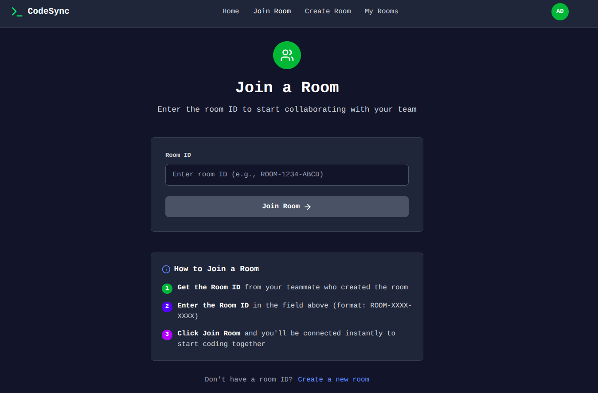

# 🚀 CodeSync — Real-Time Collaborative Code Editor

**CodeSync** is a real-time collaborative coding platform that empowers developers to write, edit, and run code together — seamlessly. Built with WebSockets and CRDTs, it’s designed for speed, clarity, and connection.

---

## ✨ Features

- 🧠 **Live Collaboration** — Edit code with others in real time using CRDT-powered sync.
- 🖱️ **Live Cursors & User Labels** — See who’s editing what, with dynamic cursor colors and usernames.
- 🧪 **Code Execution** — Run code instantly using Judge0 integration.
- 💬 **Team Chat** - Communicate in real-time with your teammates using integrated text chat.
- 🔐 **Authentication** — Secure login/signup with cookie-based sessions.
- 💾 **Autosave** — Never lose progress with backend-synced autosave.
- 🧩 **Modular Architecture** — Clean separation of frontend, backend, and WebSocket server.

---

## 🧱 Tech Stack

| Layer        | Tech Used |
|--------------|-----------|
| **Frontend** | React, React Router, Monaco Editor, Axios, React Hot Toast, Lucide React Icons|
| **Backend**  | Express, Node.js, MongoDB |
| **Collab Engine** | Hocuspocus (Yjs), WebSockets |
| **Execution** | Judge0 API |
| **Deployment** | Vercel (Frontend), Render (Backend + Hocuspocus), Atlas (MongoDB) |
| **Auth** | Cookie-based sessions with CORS & secure flags |

---

## 📸 Screenshots

<table width="100%">
  <tr>
    <td width="50%" align="center">
      <b>Editor Page</b> 
      
    </td>
    <td width="50%" align="center">
      <b>My Rooms Page</b> 
      
    </td>
  </tr>
  <tr>
    <td width="50%" align="center">
      <b>Create Room Page</b> 
      
    </td>
    <td width="50%" align="center">
      <b>Join Room Page</b> 
      
    </td>
  </tr>
</table>

---

## 🌍 Live Demo
- 🔗https://codesync-six-gules.vercel.app

---

## 🛡️ Security & Privacy
- Cookies are **HttpOnly**, **Secure**, and **SameSite=None** for cross-origin safety.
- CORS is configured to allow frontend-backend communication securely.

